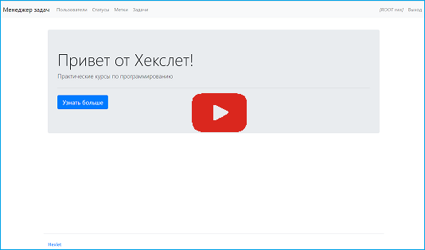

### Hexlet tests and linter status:

# TASK MANAGER
ticket management system
## useful features:
1. create a ticket and display list of tickets
2. ticket editing and specify status, label and executor
3. create and display list of: statuses, label и users
4. authentication system

## how it works:
1. the user must log in or create a new account
2. authorized user can create and update tickets, statuses and labels
3. only the author can delete tickets and own account

## demo version:
https://task-managet-django.onrender.com/

or watch the video:

## technical information

### info about structure of db

### tech stack
djnago, python, poetry, gunicorn, jinja2, bootstrap, rollbar, whitenoise
